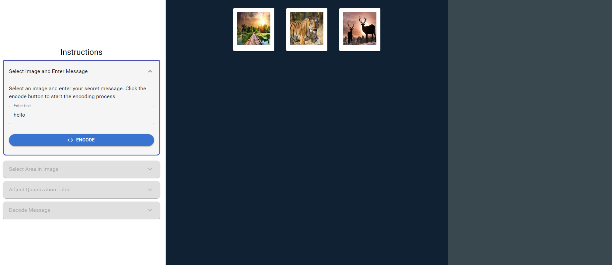
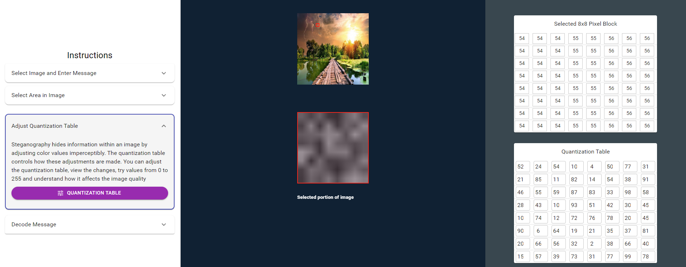
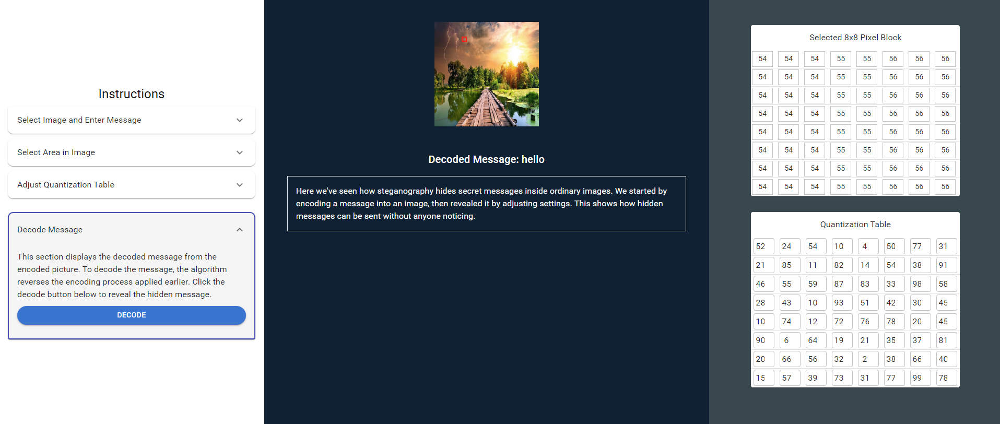

1. Select an image from the provided images.

2. Click on the image to select a specific portion.

3. Click the "Quantization Table" button, adjust the values, and analyze the changes in the selected image portion.

4. Click the "Decode" button to reveal the hidden message.

